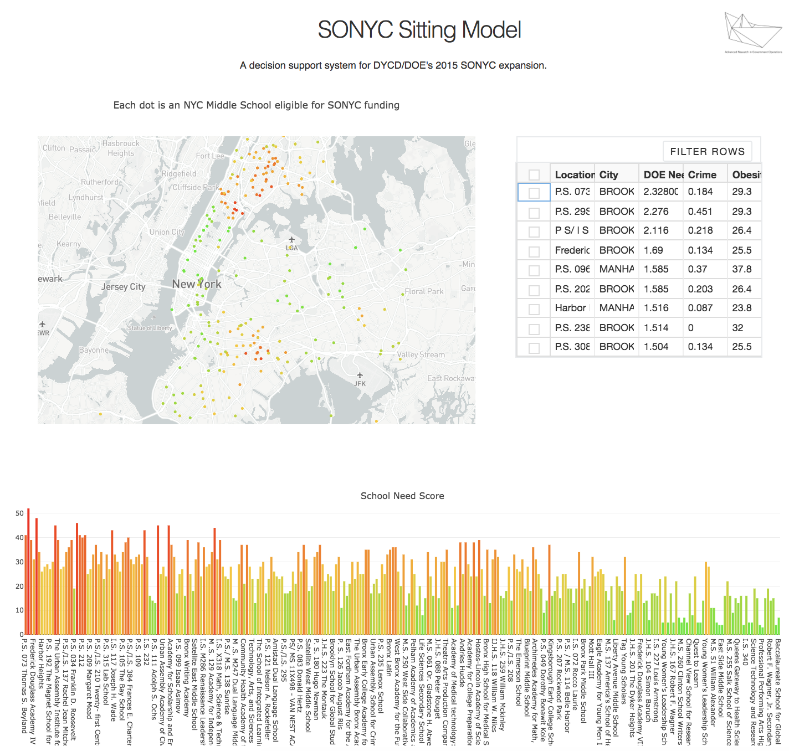

# SONYC-Dash-App

Dashboard: https://sonyc-app.herokuapp.com

A decision support system to help 2015 SONYC expansion.
 
"School’s Out New York City (SONYC) was implemented in FY 2015. In partnership with other city agencies, including the Department of Youth and Community Development, pupils were provided with educational services to help build solid foundations for the children both academically and socially, both after school and over the summer. An additional $140.9 million dollars was allocated for this program"

The dashboard helps the decision makers to prioritize the schools based on "Need Score". The metric is based on school attendance, crime rate and obesity rate.

 
Methods: Data Analysis (Python/R), Spatial Analysis (Geopy, Geopandas), Visualization (Plotly, Dash), Deployment (Heroku)
 

